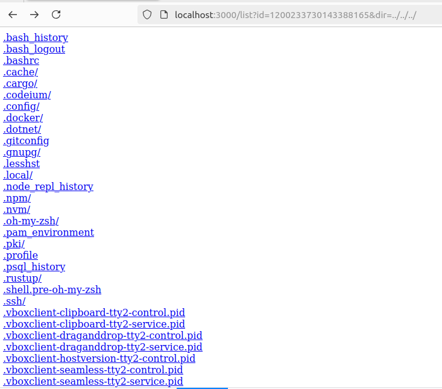
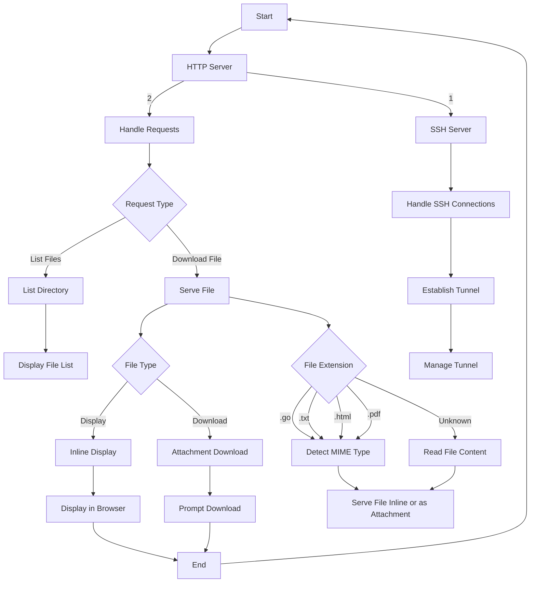

# Http tunnel to ssh

# Usage 

Listen ssh connections:

```sh
go run main.go
```

Connect with ssh: 

```sh
ssh localhost -p 2222
```

output : 

```
tunnel ID ->  1200233730143388165
```

Access it : 

```
http://localhost:3000/list?id=1200233730143388165&dir=../../../
```

Should give: 




# Workflow design

